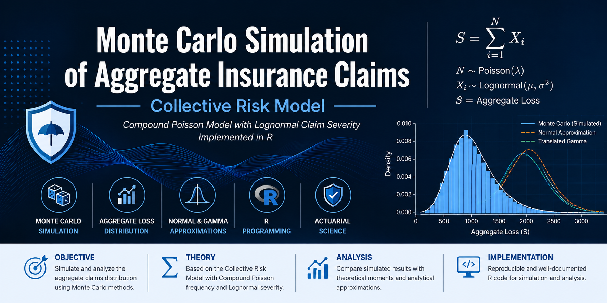

  

# Monte Carlo Simulation of Aggregate Insurance Claims

> A Monte Carlo simulation framework for studying aggregate insurance losses under the Collective Risk Model using a Compound Poisson distribution implemented in R.

# Monte Carlo Simulation of Aggregate Insurance Claims

> A Collective Risk Model implemented in R.

---

## Overview

Aggregate insurance losses are among the most important quantities studied in actuarial science and risk management. Since both the claim frequency and the claim severity are random variables, the total amount paid by an insurance company over a given period is also a random variable.

The Collective Risk Model describes the aggregate loss of an insurance portfolio as the random sum

**S = X₁ + X₂ + ··· + Xₙ**

where:

- **N** is the random number of claims;
- **Xᵢ** is the amount of the *i*-th claim;
- **S** is the aggregate loss of the insurance portfolio.

This project implements a Monte Carlo simulation framework in **R** to estimate the probability distribution of aggregate insurance losses assuming:

- **Claim frequency:** Poisson distribution;
- **Claim severity:** Lognormal distribution.

The simulated aggregate loss distribution is compared with two classical analytical approximations widely used in actuarial science:

- Normal Approximation;
- Translated Gamma Approximation.

The project combines stochastic simulation, probability theory and actuarial modeling to illustrate how empirical and theoretical approaches can be used to analyze aggregate insurance losses.
---

## Motivation

Insurance companies must estimate the total amount of claims that may occur during a given period in order to determine premium levels, establish technical reserves and assess financial risk.

In the Collective Risk Model, the aggregate loss is represented as the sum of a random number of individual claims. Since both the claim frequency and the claim severity are random variables, obtaining the exact distribution of the aggregate loss is often analytically difficult.

Monte Carlo simulation provides a flexible and powerful computational approach for approximating the aggregate loss distribution without requiring closed-form solutions. It also allows comparisons between empirical results and classical analytical approximations.

This project was developed to illustrate these concepts through a complete implementation in R, combining stochastic simulation with actuarial modeling and statistical analysis.

---

## Mathematical Background

The **Collective Risk Model** is one of the fundamental models in actuarial science for representing the total amount of claims incurred by an insurance portfolio during a fixed period.

The aggregate loss is defined as

> **S = X₁ + X₂ + ··· + Xₙ**

where:

- **N** is the random number of claims;
- **X₁, X₂, ..., Xₙ** are independent and identically distributed claim severities;
- **S** is the aggregate insurance loss.

In this project, the following probabilistic assumptions are adopted:

### Claim Frequency

The number of claims follows a Poisson distribution:

> **N ~ Poisson(λ)**

where **λ** represents the expected number of claims.

### Claim Severity

Individual claim amounts follow a Lognormal distribution:

> **X ~ Lognormal(μ, σ²)**

where:

- **μ** is the logarithmic mean;
- **σ²** is the logarithmic variance.

### Aggregate Loss Moments

For the Compound Poisson model, the first two moments of the aggregate loss are given by

**Expected Value**

> **E[S] = λE[X]**

**Variance**

> **Var(S) = λVar(X) + λ(E[X])²**

These theoretical expressions are compared with the empirical estimates obtained through Monte Carlo simulation.

---

## Methodology

*Description of the Monte Carlo simulation algorithm.*

---

## Project Structure

*The organization of the project files will be described here.*

---

## Results

*Simulation results, figures and statistical analyses will be presented here.*

---

## Applications

*Possible applications in actuarial science, insurance and risk management.*

---

## How to Run

*Instructions for executing the project in R.*

---

## References

*Bibliographic references used in the project.*

---

## Author

**Valberto Feitosa**

Professor and Researcher

Federal Institute of Education, Science and Technology of Ceará (IFCE)

Data Science • Statistics • Artificial Intelligence • Actuarial Science
