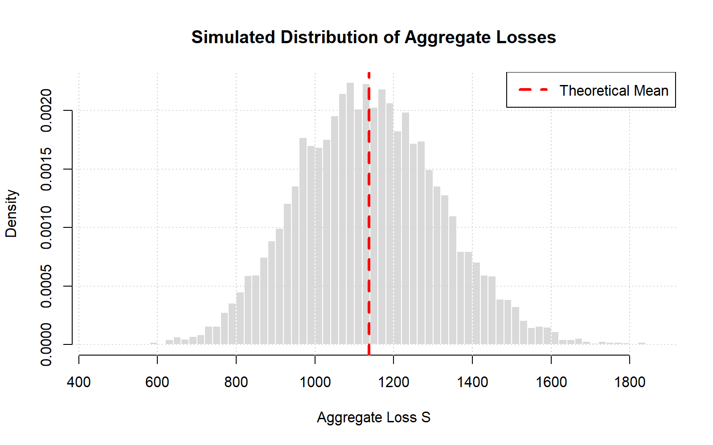
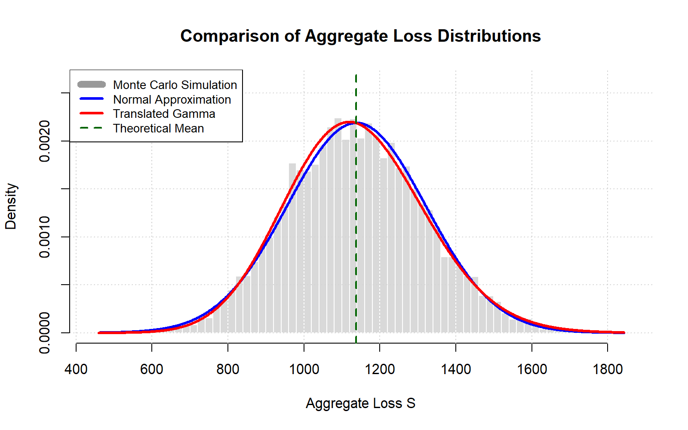

<p align="center">
  
</p>

# Monte Carlo Simulation of Aggregate Insurance Claims

> A Monte Carlo simulation framework for studying aggregate insurance losses under the Collective Risk Model using a Compound Poisson distribution implemented in R.

---


---

## Contents

| Section |
|----------|
| [Overview](#overview) |
| [Motivation](#motivation) |
| [Mathematical Background](#mathematical-background) |
| [Theoretical Foundation](#theoretical-foundation) |
| [Methodology](#methodology) |
| [Project Structure](#project-structure) |
| [Results](#results) |
| [Applications](#applications) |
| [How to Run](#how-to-run) |
| [References](#references) |
| [License](#license) |
| [Author](#author) |

---

## Overview

Aggregate insurance losses are among the most important quantities studied in actuarial science and risk management. Since both the claim frequency and the claim severity are random variables, the total amount paid by an insurance company over a given period is also a random variable.

The Collective Risk Model describes the aggregate loss of an insurance portfolio as the random sum

**S = X₁ + X₂ + ··· + Xₙ**

where:

- **N** is the random number of claims;
- **Xᵢ** is the amount of the *i*-th claim;
- **S** is the aggregate loss of the insurance portfolio.

This project implements a Monte Carlo simulation framework in **R** to estimate the probability distribution of aggregate insurance losses assuming:

- **Claim frequency:** Poisson distribution;
- **Claim severity:** Lognormal distribution.

The simulated aggregate loss distribution is compared with two classical analytical approximations widely used in actuarial science:

- Normal Approximation;
- Translated Gamma Approximation.

The project combines stochastic simulation, probability theory and actuarial modeling to illustrate how empirical and theoretical approaches can be used to analyze aggregate insurance losses.
---

## Motivation

Insurance companies must estimate the total amount of claims that may occur during a given period in order to determine premium levels, establish technical reserves and assess financial risk.

In the Collective Risk Model, the aggregate loss is represented as the sum of a random number of individual claims. Since both the claim frequency and the claim severity are random variables, obtaining the exact distribution of the aggregate loss is often analytically difficult.

Monte Carlo simulation provides a flexible and powerful computational approach for approximating the aggregate loss distribution without requiring closed-form solutions. It also allows comparisons between empirical results and classical analytical approximations.

This project was developed to illustrate these concepts through a complete implementation in R, combining stochastic simulation with actuarial modeling and statistical analysis.

---

## Mathematical Background

The **Collective Risk Model** is one of the fundamental models in actuarial science for representing the total amount of claims incurred by an insurance portfolio during a fixed period.

The aggregate loss is defined as

> **S = X₁ + X₂ + ··· + Xₙ**

where:

- **N** is the random number of claims;
- **X₁, X₂, ..., Xₙ** are independent and identically distributed claim severities;
- **S** is the aggregate insurance loss.

In this project, the following probabilistic assumptions are adopted:

### Claim Frequency

The number of claims follows a Poisson distribution:

> **N ~ Poisson(λ)**

where **λ** represents the expected number of claims.

### Claim Severity

Individual claim amounts follow a Lognormal distribution:

> **X ~ Lognormal(μ, σ²)**

where:

- **μ** is the logarithmic mean;
- **σ²** is the logarithmic variance.

### Aggregate Loss Moments

For the Compound Poisson model, the first two moments of the aggregate loss are given by

**Expected Value**

> **E[S] = λE[X]**

**Variance**

> **Var(S) = λVar(X) + λ(E[X])²**

These theoretical expressions are compared with the empirical estimates obtained through Monte Carlo simulation.

---
## Theoretical Foundation

This project is grounded in the **Collective Risk Model**, one of the classical frameworks in actuarial science for modeling aggregate insurance losses.

The implementation combines:

- Compound Poisson frequency modeling;
- Lognormal claim severity;
- Monte Carlo simulation;
- Theoretical moment calculations;
- Normal approximation;
- Translated Gamma approximation.

Together, these components provide a comprehensive framework for studying aggregate insurance losses and comparing empirical simulation results with classical analytical approximations.

---
## Methodology

The aggregate loss distribution is estimated using a Monte Carlo simulation based on the Compound Poisson Collective Risk Model.

The simulation procedure consists of the following steps:

1. Define the model parameters:
   - Poisson parameter (**λ**) for the claim frequency;
   - Lognormal parameters (**μ** and **σ**) for the claim severity.

2. Generate a random number of claims from the Poisson distribution.

3. Simulate individual claim amounts from the Lognormal distribution.

4. Compute the aggregate loss by summing all simulated claim amounts.

5. Repeat the procedure for **10,000 Monte Carlo simulations** to obtain the empirical distribution of the aggregate loss.

6. Compute descriptive statistics, including the empirical mean, variance and standard deviation.

7. Compare the simulated results with:
   - the theoretical moments of the Compound Poisson model;
   - the Normal approximation;
   - the Translated Gamma approximation.

Finally, graphical analyses are performed to compare the empirical distribution obtained by simulation with the analytical approximations.

---

## Project Structure

```text
monte-carlo-aggregate-claims-r/
│
├── R/
│   └── aggregate_claims_simulation.R
│
├── images/
│   ├── banner.png
│   ├── histogram_simulated_distribution.png
│   └── distribution_comparison.png
│
├── results/
│   └── simulation_summary.txt
│
├── README.md
├── LICENSE
└── .gitignore
```

### Directory Description

| Directory / File | Description |
|------------------|-------------|
| **R/** | Contains the complete R implementation of the Monte Carlo simulation. |
| **images/** | Stores the project banner and all figures generated during the simulation. |
| **results/** | Contains the numerical summary of the simulation results. |
| **README.md** | Main project documentation. |
| **LICENSE** | MIT License for the project. |
| **.gitignore** | Specifies files and directories ignored by Git. |

---

## Results

The Monte Carlo simulation produced **10,000 independent realizations** of the aggregate insurance loss under the Compound Poisson Collective Risk Model.

The empirical estimates obtained from the simulation showed excellent agreement with the theoretical moments of the aggregate loss distribution.

### Simulation Summary

| Statistic | Simulated | Theoretical |
|-----------|----------:|------------:|
| Mean | 1139.30 | 1137.99 |
| Variance | 33261.80 | 33257.10 |
| Standard Deviation | 182.38 | 182.37 |

The close agreement between the simulated and theoretical values demonstrates the correctness of the implementation and the convergence of the Monte Carlo estimator.

---

### Simulated Distribution

<p align="center">
  
</p>

*Histogram of the simulated aggregate insurance losses.*

---

### Distribution Comparison

<p align="center">
  
</p>

*Comparison between the Monte Carlo simulation, the Normal approximation and the Translated Gamma approximation.*

The Normal approximation provides accurate results due to the relatively large value of the Poisson parameter (λ = 50), making the Central Limit Theorem applicable.

The Translated Gamma approximation also provides an excellent fit by preserving the theoretical mean and variance of the aggregate loss distribution.

---
## Applications

The methodology presented in this project can be applied to several problems in actuarial science, insurance and quantitative risk analysis.

Some practical applications include:

- Estimation of aggregate insurance losses.
- Premium calculation based on collective risk models.
- Evaluation of technical reserves.
- Risk measurement and capital allocation.
- Solvency assessment of insurance portfolios.
- Monte Carlo simulation for stochastic risk models.
- Validation of analytical approximations used in actuarial practice.
- Educational support for courses in Probability, Statistics and Actuarial Science.

Although this project considers a Compound Poisson model with Lognormal claim severity, the same computational framework can be extended to other claim frequency and severity distributions commonly used in actuarial science.

---

## How to Run

### Prerequisites

Before running the project, ensure that the following software is installed:

- R (version 4.0 or later)
- RStudio (recommended)

### Installation

Clone this repository:

```bash
git clone https://github.com/ValbertoFeitosa/monte-carlo-aggregate-claims-r.git
```

Open the file:

```text
R/aggregate_claims_simulation.R
```

Run the script in R or RStudio.

### Output

The script will:

- compute the theoretical moments of the Compound Poisson model;
- perform 10,000 Monte Carlo simulations;
- compare the simulated and theoretical results;
- generate the histogram of the aggregate loss distribution;
- generate the comparison between the Monte Carlo simulation, the Normal approximation and the Translated Gamma approximation;
- automatically save the figures in the `images` directory.

---

## References

1. Bowers, N. L., Gerber, H. U., Hickman, J. C., Jones, D. A., & Nesbitt, C. J. (1997). *Actuarial Mathematics* (2nd ed.). The Society of Actuaries.

2. Charpentier, A. (Ed.). (2016). *Computational Actuarial Science with R*. Chapman & Hall/CRC.

3. Chwif, L., & Medina, A. C. (2013). *Modelagem e Simulação de Eventos Discretos: Teoria e Prática* (3rd ed.). Elsevier.

4. Ferreira, P. P. (2002). *Modelos de Precificação e Ruína para Seguros de Curto Prazo*. FUNENSEG.

5. Ross, S. M. (2012). *Simulation* (5th ed.). Academic Press.

6. Silva, A. M. (2025). *Fundamentos de Simulação: Aplicações em Planilha Eletrônica, Python e R*. Alta Books.

---

## License

This project is licensed under the **MIT License**.

See the [LICENSE](LICENSE) file for more information.

---

## Author

**Valberto Feitosa**

Professor and Researcher

Federal Institute of Education, Science and Technology of Ceará (IFCE)

### Research Interests

- Data Science
- Applied Statistics
- Artificial Intelligence
- Actuarial Science
- Machine Learning
- Educational Data Mining

**GitHub:** https://github.com/ValbertoFeitosa

**LinkedIn:** https://www.linkedin.com/in/valberto-feitosa-7239511b1/
